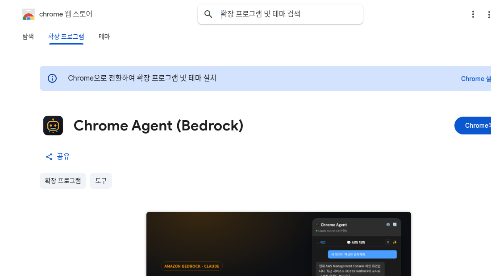

  <h1>Chrome Agent (Bedrock)</h1>
  
<strong>Amazon Bedrock 기반 Chrome 사이드패널 AI 어시스턴트. 현재 보고 있는 웹페이지를 이해하고, 필요하면 대신 조작까지 해줍니다.</strong>

  

    
    
    
    
  

  
<a href="https://chromewebstore.google.com/detail/odnmhmmdoanhdpjioefjeicglgdacbkm"><strong>🧩 Chrome Web Store에서 설치하기</strong></a>

  

---

이 저장소는 Chrome Web Store에 게시된 **Chrome Agent (Bedrock)** 확장의 **공개 문서 보관소**입니다.
개인정보처리방침과 라이선스를 공개적으로 접근할 수 있도록 유지합니다.

## 무엇을 하나요?

브라우저 우측 **사이드패널**에 떠 있는 AI 어시스턴트입니다. 본인 **AWS Bedrock 계정**의 Claude 모델로 동작합니다.

| 모드 | 하는 일 |
|------|---------|
| 💬 **채팅** | 현재 페이지 내용 기반 Q&A. 본문 읽기·웹 검색·화면 이미지 인식 |
| 🤖 **Agent (Browser Use)** | 열린 탭의 폼을 대신 입력·클릭·진행. 민감 동작(결제·제출 등)은 승인 후 실행 |

## 링크 · 문서

- **[Chrome Web Store 설치 페이지](https://chromewebstore.google.com/detail/odnmhmmdoanhdpjioefjeicglgdacbkm)**
- **[개인정보처리방침 (Privacy Policy)](PRIVACY.md)** — 데이터 처리 방침 (개발자는 어떤 데이터도 수집하지 않습니다)
- **[라이선스 (License)](LICENSE)** — Apache License 2.0

## 소스 코드

확장의 전체 소스 코드는 비공개 저장소에서 관리됩니다. 문의는 아래로 연락해 주세요.

---

문의: [@jesamkim](https://github.com/jesamkim) · © 2026 Jesam Kim · [Apache License 2.0](LICENSE)
