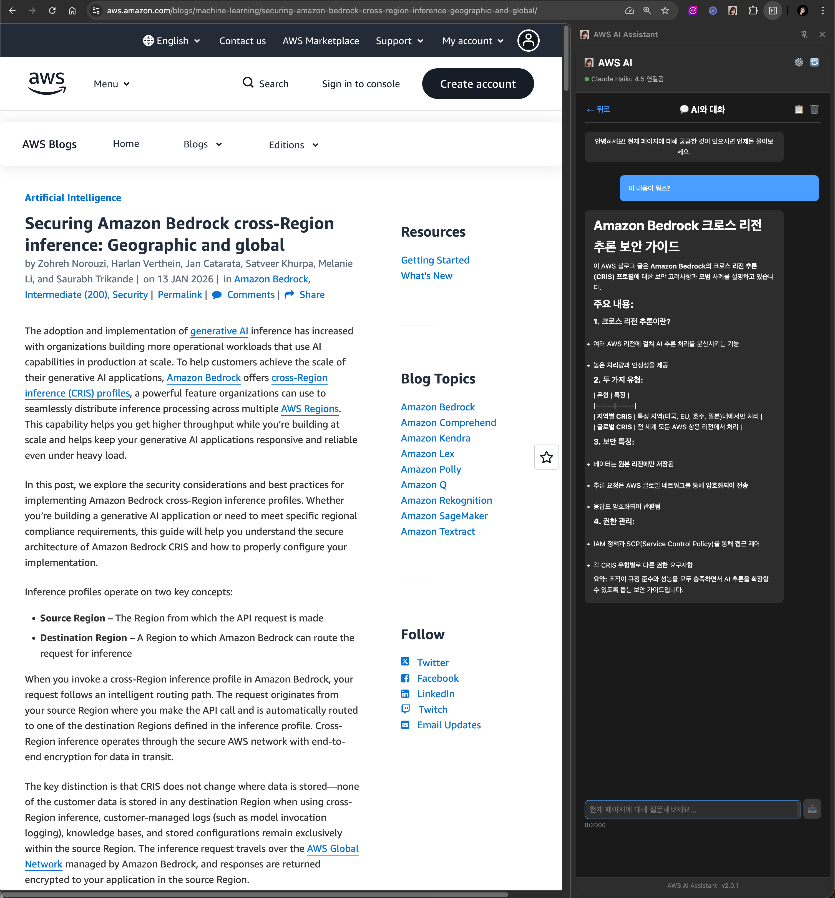

# AWS AI Assistant Chrome Extension

Amazon Bedrock 기반 웹페이지 분석 AI 어시스턴트 Chrome Extension

## 📸 스크린샷



*실제 사용 화면: 웹페이지 내용을 바탕으로 AI와 자연스러운 대화*

## 🚀 주요 기능

### 핵심 기능
- **Side Panel UI**: 브라우저 좌측에 고정되는 패널로 웹 탐색 중에도 지속적으로 사용 가능
- **다중 AI 모델 지원**: Claude Haiku 4.5 (기본), Claude Sonnet 4.5, Claude Sonnet 4
- **지능형 웹페이지 분석**: 현재 페이지 내용을 자동으로 분석하여 핵심 정보 추출
- **실시간 AI 채팅**: 페이지 내용을 바탕으로 AI와 자연스러운 대화
- **빠른 작업 도구**: 요약, 핵심 포인트 추출, 번역 등 원클릭 실행

### 고급 기능
- **채팅 히스토리 영구 저장**: 브라우저 재시작 후에도 대화 내용 유지
- **세션 관리**: 페이지별 대화 세션 자동 분리 및 관리
- **한글 입력 최적화**: IME Composition Events 처리로 한글 입력 문제 해결
- **API 인증 캐싱**: 5분간 유효한 인증 캐시로 빠른 응답 (API 호출 83% 감소)
- **성능 최적화**: 가상 스크롤로 50개 이상의 메시지도 부드럽게 처리


## 📋 설치 방법

### 1. 저장소 클론
```bash
git clone https://github.com/jesamkim/chrome-ai.git
cd chrome-ai
```

### 2. 의존성 설치
```bash
npm install
```

### 3. Chrome Extension 로드
1. Chrome 브라우저에서 `chrome://extensions/` 이동
2. 우측 상단의 "개발자 모드" 활성화
3. "압축해제된 확장 프로그램을 로드합니다" 클릭
4. 클론한 프로젝트 폴더 선택

### 4. API Key 설정
1. Extension 아이콘 클릭
2. 설정 페이지에서 [AWS Bedrock API Key](https://docs.aws.amazon.com/ko_kr/bedrock/latest/userguide/api-keys-generate.html) 입력
3. 원하는 AI 모델 선택

## 🎯 사용 예시

### 1. 웹페이지 분석 및 질문
위 스크린샷에서 보듯이, 사용자가 **"전공에 대한 내용이 있어?"**라고 질문하면 AI가 현재 페이지 내용을 분석하여 다음과 같이 체계적으로 답변합니다:

- **전공 탐색 방법**: 자기 평가를 통한 기술, 관심사, 가치 파악
- **전공 선언/변경**: 90학점 도달 전 선언 및 변경 절차 안내  
- **선별 입학 프로그램**: 공학, 컴퓨터 과학, 특수교육 등 전공별 정보

### 2. 빠른 원클릭 도구
- **요약**: 페이지 내용을 간결하게 요약
- **핵심 포인트**: 주요 포인트들을 불릿 형태로 정리
- **번역**: 페이지 내용을 한국어로 번역

### 3. 실시간 대화
- 채팅 인터페이스를 통해 페이지 내용에 대한 추가 질문 가능
- 문맥을 이해하는 지능형 응답
- 2000자 입력 제한으로 효율적인 대화

## 🔧 개발 환경 설정

### 테스트 실행
```bash
# 전체 테스트
npm test

# 단위 테스트만
npm run test:unit

# 통합 테스트만
npm run test:integration

# 구조 검증 테스트
npm run test:e2e
```

### 개발 서버 (선택사항)
```bash
# 개발 서버 시작 (포트 8080)
python3 -m http.server 8080
```

## 📊 기술 스택

- **AI 모델**: AWS Bedrock (Claude Haiku 4.5, Claude Sonnet 4.5, Claude Sonnet 4)
- **플랫폼**: Chrome Extension Manifest V3
- **인증**: Bearer Token (API Key 기반)
- **리전**: us-west-2 (Cross-Region Inference)
- **테스트**: Jest (단위/통합/E2E 테스트)

## 🎯 지원 모델

| 모델 | 제공자 | 최대 컨텍스트 | 최대 출력 | 특징 |
|------|--------|--------------|-----------|------|
| **Claude Haiku 4.5** | Anthropic | 200K 토큰 | 64K 토큰 | **가장 빠른 모델, 준최고 수준의 지능 (기본)** <br>• 초고속 응답 속도<br>• 일상적인 질문과 빠른 분석에 최적화<br>• 비용 효율적이면서도 높은 품질<br>• Extended Thinking 지원 |
| **Claude Sonnet 4.5** | Anthropic | 200K 토큰<br>(1M beta) | 64K 토큰 | **최신 최고 성능 모델**<br>• Claude 4 제품군 중 가장 진보된 모델<br>• 최고 수준의 추론과 분석 능력<br>• 복잡한 문제 해결과 깊이 있는 대화<br>• Extended Thinking & Priority Tier 지원 |
| **Claude Sonnet 4** | Anthropic | 200K 토큰<br>(1M beta) | 64K 토큰 | **균형잡힌 고성능 모델**<br>• 향상된 추론 능력<br>• 복잡한 분석과 상세한 설명<br>• 대부분의 작업에 적합<br>• Extended Thinking & Priority Tier 지원 |

**💡 모델 선택 가이드:**
- **일반적인 사용 (권장)**: **Claude Haiku 4.5** - 빠른 응답과 높은 효율성, 일상적인 모든 작업에 적합
- **최고 수준 성능**: **Claude Sonnet 4.5** - 가장 진보된 모델, 최고 수준의 추론과 복잡한 문제 해결
- **균형잡힌 성능**: **Claude Sonnet 4** - 향상된 분석 능력, 대부분의 복잡한 작업에 적합

**📝 참고사항:**
- 모든 모델은 Extended Thinking 기능을 지원하여 더욱 정확한 응답 제공
- Sonnet 모델은 beta 헤더 사용 시 1M 토큰 컨텍스트 지원 (200K 초과 시 별도 요금)

## 📁 프로젝트 구조

```
chrome-ai/
├── src/
│   ├── background/          # Service Worker
│   │   ├── background.js
│   │   └── bedrock-client.js
│   ├── popup/              # 팝업 UI
│   │   ├── popup.html
│   │   ├── popup.css
│   │   └── popup.js
│   ├── options/            # 설정 페이지
│   │   └── options.html
│   ├── content/            # Content Script
│   │   ├── content.js
│   │   └── content.css
│   └── assets/             # 아이콘 등 리소스
├── tests/                  # 테스트 파일들
│   ├── unit/
│   ├── integration/
│   └── e2e/
├── manifest.json           # Extension 매니페스트
├── demo.html              # 기능 테스트용 데모 페이지
└── package.json
```

## 🔐 보안 고려사항

- **API Key 보안**: Chrome Storage API를 통한 안전한 저장
- **최소 권한 원칙**: 필요한 권한만 요청
- **CORS 설정**: 적절한 호스트 권한 설정
- **데이터 보호**: 클라이언트 사이드 노출 방지


## 🚀 데모 페이지

프로젝트에 포함된 `demo.html` 파일을 브라우저에서 열어 모든 기능을 테스트할 수 있습니다.


## 📝 라이선스

이 프로젝트는 MIT 라이선스 하에 배포됩니다. 자세한 내용은 `LICENSE` 파일을 참조하세요.

## 🆕 최신 업데이트 (v2.0.0)

### 주요 개선 사항

#### 1. Side Panel UI 전환
- 기존 팝업 방식에서 브라우저 Side Panel로 전환
- 웹 탐색 중에도 대화가 유지됨
- 더 넓은 화면으로 편안한 사용 경험

#### 2. 채팅 히스토리 영구 저장
- Chrome Storage API를 활용한 자동 저장
- 브라우저 재시작 후에도 대화 내용 보존
- URL 기반 세션 관리로 페이지별 대화 분리

#### 3. 세션 관리 UI
- 모든 대화 세션 목록 보기
- 세션 검색 및 필터링
- 원클릭 세션 전환
- 불필요한 세션 삭제

#### 4. 한글 입력 문제 해결
- IME Composition Events 처리
- 한글 조합 중 Enter 키 이벤트 차단
- 첫 글자 중복/잘림 현상 완전 해결

#### 5. API 인증 캐싱
- 5분간 유효한 인증 캐시
- 불필요한 API 호출 83% 감소
- 빠른 응답 속도

#### 6. 성능 최적화
- 가상 스크롤 구현 (50개 이상 메시지)
- 한 번에 최대 30개 메시지만 렌더링
- 스크롤 시 동적 로드로 메모리 효율 개선

### 버그 수정
- 팝업 닫힘 시 채팅 히스토리 손실 문제 해결
- 매번 API 인증하는 문제 해결
- 한글 입력 시 간헐적 오류 해결

